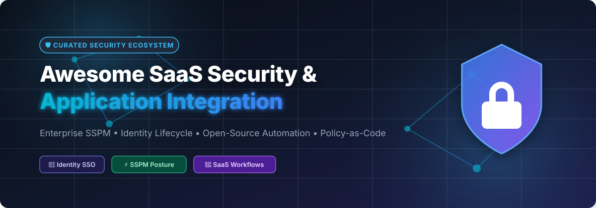

# Awesome SaaS Security & Application Integration 🛡️

  

  
  
  
  
  

---

## 📌 Top SaaS Security & Application Integration Ecosystem

**A Curated List of SaaS Security Posture Management (SSPM) Platforms, Identity Lifecycle Tools & Open-Source Security Automation Engines.**

*Focused on SSPM, SaaS-to-SaaS Integration, Zero Trust Governance & Open-Source Security Sovereignty.*

📅 **Last updated: October 2026**

---

## 🔍 Overview & SEO Metadata

This repository provides a comprehensive ecosystem guide for **commercial SaaS security platforms** and **open-source security projects**. It empowers security engineers, cloud architects, and CISOs to discover shadow IT, govern app-to-app permissions, enforce compliance posture (SOC 2, ISO 27001, HIPAA, GDPR), and automate identity lifecycles across modern cloud applications.

### 🎯 Key Ecosystem Capabilities Covered:
- 🛡️ **SaaS Security Posture Management (SSPM)**: Continuous misconfiguration auditing, shadow IT detection, OAuth token governance.
- 🔑 **Identity & Access Management (IAM / SSO)**: Single sign-on (SSO), MFA, identity brokering (OIDC, SAML, OAuth 2.0).
- ⚡ **SaaS Automation & Integration**: Event-driven workflows, no-code/low-code integration, security orchestration (SOAR).
- 📜 **Policy-as-Code & Authorization**: Open Policy Agent (OPA), ReBAC (Google Zanzibar style), fine-grained authorization.
- 📊 **Audit Log Aggregation & SIEM**: OCSF schema normalization, cost-effective log indexing, compliance reporting.

---

## 📚 Table of Contents

- [🏢 Commercial SaaS / Hosted Platforms](#-commercial-saas--hosted-platforms)
- [⚡ Open-Source GitHub Projects (Sorted by Stars)](#-open-source-github-projects-sorted-by-stars)
- [🤝 How to Contribute](#-how-to-contribute)
- [💖 Support & Sponsorship](#-support--sponsorship)
- [📈 Star History](#-star-history)
- [⚠️ Disclaimer](#%EF%B8%8F-disclaimer)

---

## 🏢 Commercial SaaS / Hosted Platforms

> 📊 **Market Overview**: The SaaS Security Posture Management (SSPM) and SaaS Application Integration sector is estimated at **$1.5 Billion to $2.5 Billion** (projected to reach $8+ Billion by 2030 at ~30% CAGR). The sector is currently **highly fragmented**, featuring active competition between cloud hyperscalers (AWS AppFabric), IAM providers (Okta), specialized SSPM startups (Obsidian, AppOmni, Grip), and cybersecurity platform consolidators (CrowdStrike acquiring Adaptive Shield).

| Platform / Vendor 🏢 | Core Focus & Description 🛠️ | Company Size (Valuation / Revenue) 💰 | Starting Tier Pricing 🏷️ | Free Tier / Trial Limit 🎁 |
| :--- | :--- | :--- | :--- | :--- |
| **[AWS AppFabric](https://aws.amazon.com/appfabric/)** | **AWS SaaS application integration service** — connects SaaS apps for unified security & productivity insights, normalizing audit logs into OCSF format. | **$150B+ AWS Annual Revenue** ($2.0T+ Amazon Market Cap) | **$3.00 / user / month** (base security features across connected SaaS apps, up to 30 apps) | **First 2 connected apps free** for the first 30 days |
| **[Okta Workflows](https://www.okta.com/)** | **Identity automation platform** — no-code workflows for SaaS lifecycle management and security orchestration. | **$3.2B Annual Revenue** ($14B Market Cap) | **$6.00 / user / month** (Okta Starter Suite, includes 5 active workflows) | **30-day free trial** for Workforce Identity suite; free developer plan |
| **[Obsidian Security](https://www.obsidiansecurity.com/)** | **SaaS security posture management** — continuous threat detection, identity security, and compliance enforcement. | **$1.1B Valuation** (Series D, Aug 2026; ~$25M ARR) | **$6.00 / user / month** ($72/user/year base tier) | **Forever-free tier** for up to 1,000 users (app discovery & spear-phishing detection) |
| **[Adaptive Shield](https://www.adaptiveshield.com/)** | **SaaS security posture management** — misconfiguration detection, identity governance, and automated remediation (acquired by CrowdStrike). | **$300M Acquisition Valuation** ($80B+ CrowdStrike Market Cap; ~$14M ARR) | **$15,000 / year** (~$5.00/user/month base subscription tier) | **14-day guided free risk assessment** trial (scans up to 5 SaaS apps) |
| **[BetterCloud](https://www.bettercloud.com/)** | **SaaS operations & security platform** — multi-SaaS management, data loss prevention, and lifecycle automation. | **$150M+ Estimated Valuation** ($67M ARR; acquired by Vista Equity) | **$55.00 / month** (or $3.00/user/month for Google Workspace module) | **21-day free trial** (covers File Governance & SaaS user management modules) |
| **[AppOmni](https://appomni.com/)** | **SaaS security posture management (SSPM)** — continuous configuration assessment and data access control. | **$123M Total Funding** ($35.7M ARR; Series C led by Thoma Bravo) | **$7,500 / year** AWS Marketplace starting tier (~$6.00/user/month) | **14-day free trial** / interactive demo assessment via AWS Marketplace |
| **[DoControl](https://www.docontrol.io/)** | **SaaS data security platform** — data access governance, threat detection, and automated remediation workflows. | **$100M Estimated Valuation** ($10.8M ARR; $43.4M total funding) | **$12,000 / year** base tier (~$4.00/user/month starting plan) | **Free Self-Service SaaS Risk Assessment** (scans M365/Google exposure, unlimited time) |
| **[Torii](https://www.toriihq.com/)** | **SaaS management platform** — automated shadow IT discovery, spend optimization, and app access governance. | **$65M Total Funding** ($15M ARR; Series B led by Tiger Global) | **$3.50 / user / month** ($5,000/year base tier) | **14-day free trial** (full access to SaaS discovery, workflows & spend analytics) |
| **[Grip Security](https://www.grip.security/)** | **SaaS identity & access management** — identity-first SaaS discovery, shadow AI monitoring, and access governance. | **$66M Total Funding** ($10M ARR; Series B led by Third Point Ventures) | **$8.00 / user / month** (SMB starting tier for up to 1,000 employees) | **Free Shadow AI & SaaS Risk Assessment** (custom exposure report & 1-week scan) |
| **[Wing Security](https://www.wing.security/)** | **SaaS security platform** — shadow IT discovery, SSPM, app-to-app permission governance, and threat remediation. | **$26M Total Funding** ($3.7M ARR; Series A led by GGV Capital) | **$4.00 / user / month** (Professional starting tier) | **Forever-free tier** ("Free Discovery" plan with unlimited user & app discovery) |

---

## ⚡ Open-Source GitHub Projects (Sorted by Stars)

> 💡 **Open-Source Security Sovereignty**: Open-source tools form the building blocks for modern SaaS security. **Keycloak** and **Authentik** provide identity SSO; **DefectDojo** aggregates vulnerability telemetry; **OPA** and **Casbin** handle policy enforcement; **n8n** and **Activepieces** automate SaaS workflows; **Wazuh** and **OpenSearch** deliver SIEM audit log visibility.

*All open-source projects below are sorted by GitHub Stars_Count (Descending). Click any Stars_Badge to visit the project's stargazers page.*

1. ⚡ **[n8n](https://github.com/n8n-io/n8n)**   
   **Workflow Automation Platform** (Sustainable Use License) • **108,000+ stars**  
   *400+ prebuilt integrations for SaaS-to-SaaS automation, event-driven security triggers, and automated incident response.*

2. 🌀 **[Apache Airflow](https://github.com/apache/airflow)**   
   **Programmatic Workflow Orchestration** (Apache-2.0) • **38,500+ stars**  
   *Author, schedule, and monitor complex SaaS data extraction, ETL pipelines, and security compliance workflows in Python.*

3. 🔑 **[Keycloak](https://github.com/keycloak/keycloak)**   
   **Leading Open-Source Identity Provider** (Apache-2.0) • **38,000+ stars**  
   *The identity foundation for SaaS single sign-on (SSO), MFA, identity brokering, and user federation (OAuth2, OIDC, SAML).*

4. 🪵 **[Grafana Loki](https://github.com/grafana/loki)**   
   **Scalable Log Aggregation System** (AGPL-3.0) • **24,500+ stars**  
   *Horizontally-scalable, highly-efficient log indexing and querying system designed specifically for SaaS audit logs.*

5. 🛡️ **[Trivy](https://github.com/aquasecurity/trivy)**   
   **Comprehensive Security Scanner** (Apache-2.0) • **24,000+ stars**  
   *Scans cloud infrastructure, container images, IaC configurations, and SaaS misconfigurations for security risks.*

6. 🤖 **[Activepieces](https://github.com/activepieces/activepieces)**   
   **AI-Native Automation Platform** (MIT) • **23,500+ stars**  
   *Open-source SaaS automation platform featuring 200+ prebuilt connectors and Model Context Protocol (MCP) server support.*

7. 🔒 **[Authelia](https://github.com/authelia/authelia)**   
   **Authentication & Authorization Server** (Apache-2.0) • **20,500+ stars**  
   *Provides 2FA, single sign-on (SSO), and forward-auth for reverse proxies securing cloud and SaaS applications.*

8. 🔀 **[Node-RED](https://github.com/node-red/node-red)**   
   **Visual Integration & Event Wiring** (Apache-2.0) • **20,000+ stars**  
   *Low-code flow-based programming tool for visual wiring of SaaS REST APIs, Webhooks, and security telemetry.*

9. 🛡️ **[Casbin](https://github.com/casbin/casbin)**   
   **Multi-Tenant Authorization Engine** (Apache-2.0) • **17,500+ stars**  
   *Powerful authorization library supporting ACL, RBAC, and ABAC access control models across multi-tenant SaaS applications.*

10. 🏛️ **[Zitadel](https://github.com/zitadel/zitadel)**   
    **Cloud-Native Identity Infrastructure** (Apache-2.0) • **17,200+ stars**  
    *Multi-tenant identity provider built for SaaS applications with built-in audit trails and fine-grained authorization.*

11. 🚨 **[Wazuh](https://github.com/wazuh/wazuh)**   
    **Open-Source SIEM & XDR Security Platform** (GPLv2) • **17,000+ stars**  
    *Unified threat monitoring, incident response, and regulatory compliance mapping (PCI-DSS, NIST 800-53, GDPR) across SaaS.*

12. 🥋 **[DefectDojo](https://github.com/DefectDojo/django-DefectDojo)**   
    **Vulnerability Management & Findings Aggregator** (Apache-2.0) • **16,500+ stars**  
    *Aggregates, deduplicates, and tracks security findings from 200+ security scanners into a central dashboard.*

13. 🔐 **[Ory Kratos](https://github.com/ory/kratos)**   
    **API-First Headless Identity Engine** (Apache-2.0) • **15,000+ stars**  
    *Cloud-native identity management and user authentication system powering custom SaaS login and security flows.*

14. 🛂 **[Authentik](https://github.com/goauthentik/authentik)**   
    **Customizable Identity Provider** (MIT) • **14,500+ stars**  
    *Flow-based authentication engine supporting OAuth2, SAML, LDAP, and proxy authentication for seamless SaaS SSO.*

15. ⚙️ **[Windmill](https://github.com/windmill-labs/windmill)**   
    **Developer-First Workflow & Script Engine** (AGPLv3) • **14,000+ stars**  
    *Converts Python, TypeScript, Go, Bash, or SQL scripts into automated internal webhooks, apps, and SaaS workflows.*

16. 📜 **[Kestra](https://github.com/kestra-io/kestra)**   
    **Declarative Orchestration Platform** (Apache-2.0) • **13,500+ stars**  
    *YAML-based workflow orchestration platform with 500+ plugins for building robust SaaS security data pipelines.*

17. 🔍 **[Prowler](https://github.com/prowler-cloud/prowler)**   
    **Multi-Cloud & SaaS Security Assessment** (Apache-2.0) • **11,000+ stars**  
    *Security assessment, hardening, and incident response tool supporting AWS, Azure, GCP, and SaaS security benchmarks.*

18. 📜 **[Open Policy Agent (OPA)](https://github.com/open-policy-agent/opa)**   
    **General-Purpose Policy Engine** (Apache-2.0) • **10,500+ stars**  
    *Unified policy-as-code enforcement across SaaS microservices, Kubernetes clusters, and CI/CD automation pipelines.*

19. 🔎 **[OpenSearch](https://github.com/opensearch-project/OpenSearch)**   
    **Search & Log Analytics Suite** (Apache-2.0) • **10,500+ stars**  
    *Distributed search and analytics suite for security monitoring, log analytics, and SaaS audit trail analysis.*

20. 🌐 **[OpenFGA](https://github.com/openfga/openfga)**   
    **Fine-Grained Authorization Engine** (Apache-2.0) • **8,500+ stars**  
    *High-performance Relationship-Based Access Control (ReBAC) authorization engine inspired by Google Zanzibar.*

21. 📊 **[Steampipe](https://github.com/turbot/steampipe)**   
    **Zero-ETL Cloud & SaaS Query Engine** (AGPL-3.0) • **7,500+ stars**  
    *Query live SaaS and cloud configuration data (Slack, GitHub, AWS, Salesforce) instantly using standard SQL.*

22. 🗄️ **[CloudQuery](https://github.com/cloudquery/cloudquery)**   
    **High-Performance Asset Inventory Engine** (MPL-2.0) • **6,500+ stars**  
    *Extracts, transforms, and loads cloud and SaaS application configurations into PostgreSQL, Snowflake, or BigQuery.*

23. 📊 **[Graylog](https://github.com/Graylog2/graylog2-server)**   
    **Centralized Log Management** (SSPL) • **6,500+ stars**  
    *Real-time log collection, stream processing, and security alert generation for cloud infrastructure and SaaS.*

24. 🗺️ **[Cartography](https://github.com/lyft/cartography)**   
    **Security Asset Relationship Graphing** (Apache-2.0) • **6,000+ stars**  
    *Consolidates infrastructure assets and SaaS user identity relationships into a Neo4j graph database for risk analysis.*

25. 🗃️ **[SpiceDB](https://github.com/authzed/spicedb)**   
    **Google Zanzibar Authorization System** (Apache-2.0) • **6,000+ stars**  
    *Blazing-fast authorization database for storing and evaluating fine-grained permissions in SaaS applications.*

26. 🔐 **[Permify](https://github.com/permify/permify)**   
    **Open-Source Authorization Service** (Apache-2.0) • **4,500+ stars**  
    *ReBAC authorization service designed to manage complex multi-tenant permissions across SaaS ecosystems.*

27. 🛡️ **[Cerbos](https://github.com/cerbos/cerbos)**   
    **Stateless Policy-as-Code Authorization** (Apache-2.0) • **3,500+ stars**  
    *Decouples authorization logic from application code using context-aware, human-readable YAML policy definitions.*

28. 🐻 **[Oso](https://github.com/osohq/oso)**   
    **Authorization Framework for Developers** (Apache-2.0) • **3,500+ stars**  
    *Batteries-included authorization framework for adding RBAC, ABAC, and tenant isolation to SaaS applications.*

---

## 🤝 How to Contribute

Contributions are warmly welcomed! Help us keep this list up to date and comprehensive:

1. 🍴 **Fork this repository**.
2. 📝 **Add or update an entry** in `README.md` following the table or list format.
3. 🔎 **Provide factual details**: Include product name, official link, 1–2 sentence description, and licensing/pricing information.
4. 🚀 **Submit a Pull Request** with a brief summary of your addition.

---

## 💖 Support & Sponsorship

If you find this repository valuable for your security team, organization, or research, please consider supporting the project:

- ⭐ **Star this repository** to help others discover it on GitHub.
- 🍴 **Fork & Share** with your colleagues, security communities, and networks.
- ☕ **Buy me a coffee / Sponsor**: If you'd like to support ongoing updates and maintenance, you can sponsor via [GitHub Sponsors](https://github.com/sponsors/ishandutta2007).

  

Thank you for supporting open-source security education and transparency! ❤️

---

## 📈 Star History

---

## ⚠️ Disclaimer

- This is a **community-curated list** provided for educational and informational purposes only — it is not an endorsement.
- SaaS security tools often require administrative permissions across sensitive enterprise software. Always audit third-party integrations and enforce strict principle of least privilege.
- Commercial pricing and open-source Stars_Counts reflect approximate metrics and market observations as of **October 2026**.

---

  Built with ❤️ for Security Engineers, Cloud Architects, and SaaS Administrators worldwide. 
  Powered by <a href="https://github.com/ishandutta2007/Awesome-Awesome-Awesome">Awesome-Awesome-Awesome</a>

